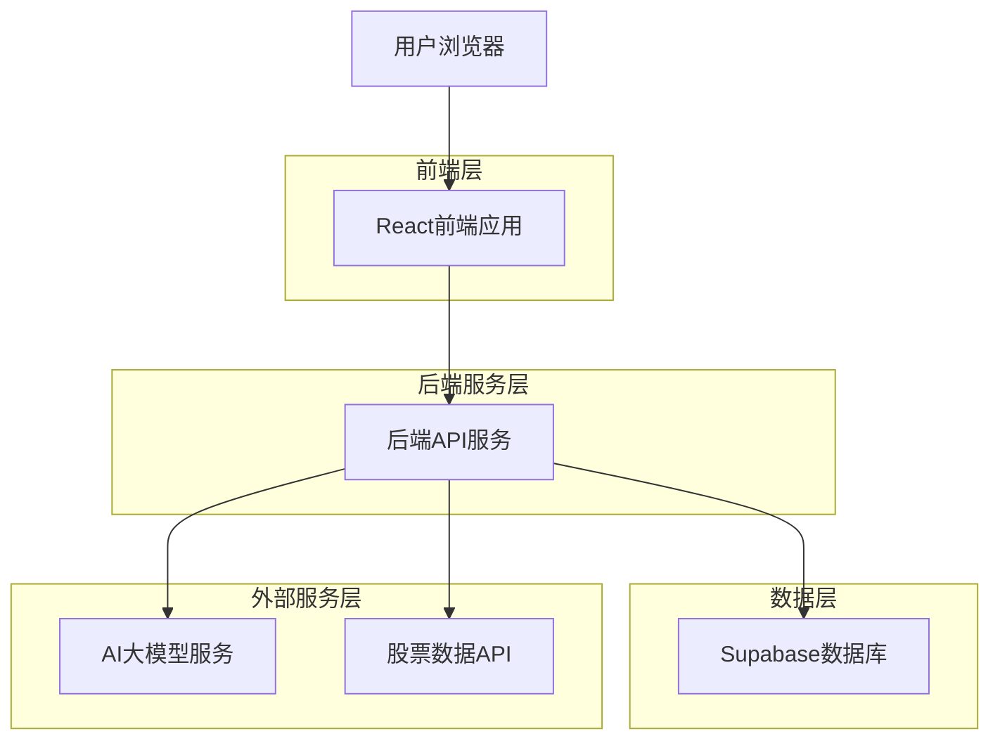
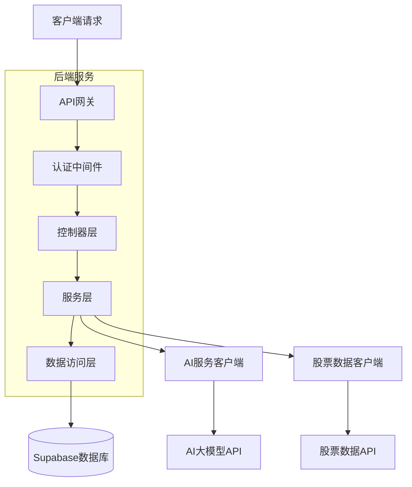
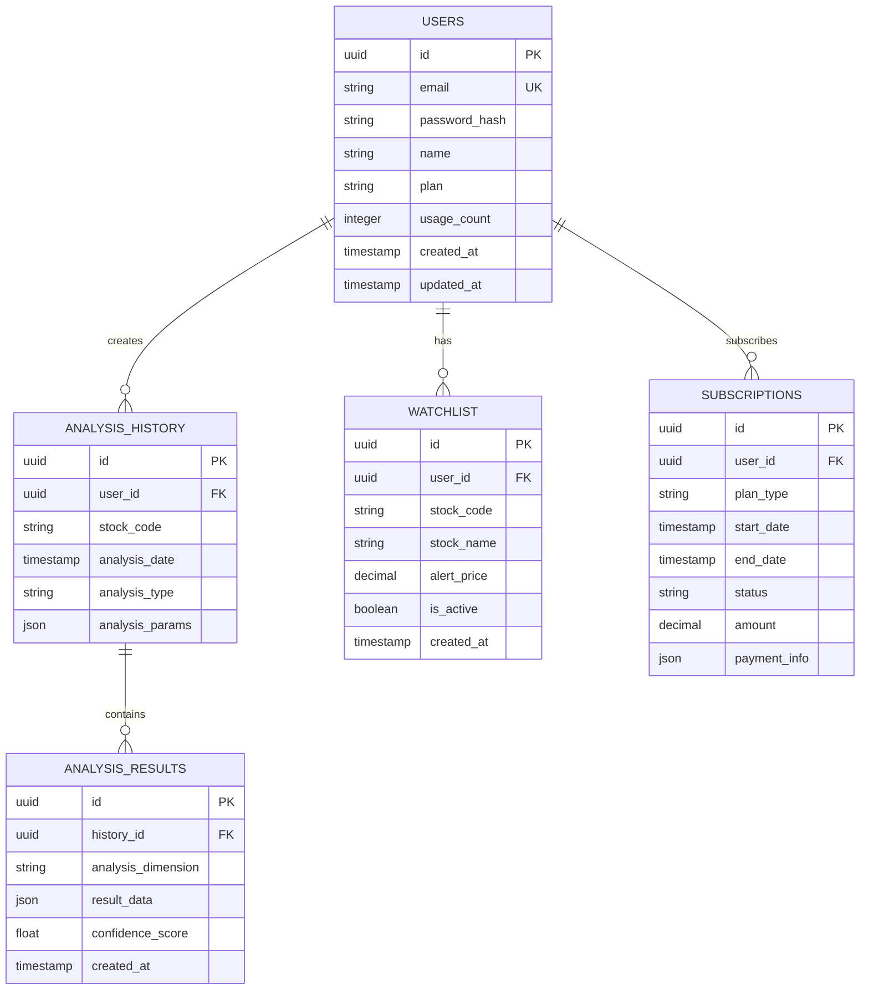

## 1. 架构设计



## 2. 技术描述
- **前端**: React@18 + TypeScript@5 + TailwindCSS@3 + Vite
- **初始化工具**: vite-init
- **后端**: Node.js@20 + Express@4 + TypeScript
- **数据库**: Supabase (PostgreSQL)
- **AI服务**: OpenAI GPT-4 API / 文心一言 API
- **股票数据**: 腾讯股票API / 新浪财经API

## 3. 路由定义
| 路由 | 用途 |
|------|------|
| / | 首页，股票搜索和市场概览 |
| /stock/:code | 股票分析结果页 |
| /login | 用户登录页面 |
| /register | 用户注册页面 |
| /profile | 个人中心页面 |
| /subscription | 订阅管理页面 |
| /history | 历史查询记录 |
| /watchlist | 自选股管理 |

## 4. API定义

### 4.1 股票相关API

**获取股票基础信息**
```
GET /api/stock/:code
```

响应参数：
| 参数名 | 类型 | 描述 |
|--------|------|------|
| code | string | 股票代码 |
| name | string | 股票名称 |
| price | number | 当前价格 |
| change | number | 涨跌额 |
| changePercent | number | 涨跌幅百分比 |
| volume | number | 成交量 |
| marketCap | number | 市值 |

**获取AI分析报告**
```
POST /api/stock/analysis
```

请求参数：
| 参数名 | 类型 | 必需 | 描述 |
|--------|------|------|------|
| code | string | true | 股票代码 |
| dimensions | array | false | 分析维度 ['technical', 'fundamental', 'sentiment'] |

响应参数：
| 参数名 | 类型 | 描述 |
|--------|------|------|
| technical | object | 技术分析报告 |
| fundamental | object | 基本面分析报告 |
| sentiment | object | 市场情绪分析 |
| recommendation | string | 投资建议 |
| riskLevel | number | 风险等级1-5 |
| confidence | number | 分析置信度 |

### 4.2 用户相关API

**用户注册**
```
POST /api/auth/register
```

请求参数：
| 参数名 | 类型 | 必需 | 描述 |
|--------|------|------|------|
| email | string | true | 邮箱地址 |
| password | string | true | 密码 |
| name | string | true | 用户名 |

**用户登录**
```
POST /api/auth/login
```

请求参数：
| 参数名 | 类型 | 必需 | 描述 |
|--------|------|------|------|
| email | string | true | 邮箱地址 |
| password | string | true | 密码 |

### 4.3 订阅相关API

**获取订阅信息**
```
GET /api/subscription
```

**升级订阅**
```
POST /api/subscription/upgrade
```

请求参数：
| 参数名 | 类型 | 必需 | 描述 |
|--------|------|------|------|
| plan | string | true | 订阅计划 'basic' / 'premium' / 'professional' |
| paymentMethod | string | true | 支付方式 |

## 5. 服务器架构图



## 6. 数据模型

### 6.1 数据模型定义



### 6.2 数据定义语言

**用户表**
```sql
CREATE TABLE users (
  id UUID PRIMARY KEY DEFAULT gen_random_uuid(),
  email VARCHAR(255) UNIQUE NOT NULL,
  password_hash VARCHAR(255) NOT NULL,
  name VARCHAR(100) NOT NULL,
  plan VARCHAR(20) DEFAULT 'free' CHECK (plan IN ('free', 'basic', 'premium', 'professional')),
  usage_count INTEGER DEFAULT 0,
  created_at TIMESTAMP WITH TIME ZONE DEFAULT NOW(),
  updated_at TIMESTAMP WITH TIME ZONE DEFAULT NOW()
);

-- 创建索引
CREATE INDEX idx_users_email ON users(email);
CREATE INDEX idx_users_plan ON users(plan);
```

**分析历史表**
```sql
CREATE TABLE analysis_history (
  id UUID PRIMARY KEY DEFAULT gen_random_uuid(),
  user_id UUID REFERENCES users(id) ON DELETE CASCADE,
  stock_code VARCHAR(20) NOT NULL,
  analysis_date TIMESTAMP WITH TIME ZONE DEFAULT NOW(),
  analysis_type VARCHAR(50) NOT NULL,
  analysis_params JSONB,
  created_at TIMESTAMP WITH TIME ZONE DEFAULT NOW()
);

-- 创建索引
CREATE INDEX idx_analysis_history_user_id ON analysis_history(user_id);
CREATE INDEX idx_analysis_history_stock_code ON analysis_history(stock_code);
CREATE INDEX idx_analysis_history_date ON analysis_history(analysis_date DESC);
```

**分析结果表**
```sql
CREATE TABLE analysis_results (
  id UUID PRIMARY KEY DEFAULT gen_random_uuid(),
  history_id UUID REFERENCES analysis_history(id) ON DELETE CASCADE,
  analysis_dimension VARCHAR(50) NOT NULL,
  result_data JSONB NOT NULL,
  confidence_score FLOAT,
  created_at TIMESTAMP WITH TIME ZONE DEFAULT NOW()
);

-- 创建索引
CREATE INDEX idx_analysis_results_history_id ON analysis_results(history_id);
CREATE INDEX idx_analysis_results_dimension ON analysis_results(analysis_dimension);
```

**自选股表**
```sql
CREATE TABLE watchlist (
  id UUID PRIMARY KEY DEFAULT gen_random_uuid(),
  user_id UUID REFERENCES users(id) ON DELETE CASCADE,
  stock_code VARCHAR(20) NOT NULL,
  stock_name VARCHAR(100) NOT NULL,
  alert_price DECIMAL(10,2),
  is_active BOOLEAN DEFAULT true,
  created_at TIMESTAMP WITH TIME ZONE DEFAULT NOW(),
  UNIQUE(user_id, stock_code)
);

-- 创建索引
CREATE INDEX idx_watchlist_user_id ON watchlist(user_id);
CREATE INDEX idx_watchlist_stock_code ON watchlist(stock_code);
```

**订阅表**
```sql
CREATE TABLE subscriptions (
  id UUID PRIMARY KEY DEFAULT gen_random_uuid(),
  user_id UUID REFERENCES users(id) ON DELETE CASCADE,
  plan_type VARCHAR(20) NOT NULL CHECK (plan_type IN ('basic', 'premium', 'professional')),
  start_date TIMESTAMP WITH TIME ZONE DEFAULT NOW(),
  end_date TIMESTAMP WITH TIME ZONE,
  status VARCHAR(20) DEFAULT 'active' CHECK (status IN ('active', 'expired', 'cancelled')),
  amount DECIMAL(10,2),
  payment_info JSONB,
  created_at TIMESTAMP WITH TIME ZONE DEFAULT NOW()
);

-- 创建索引
CREATE INDEX idx_subscriptions_user_id ON subscriptions(user_id);
CREATE INDEX idx_subscriptions_status ON subscriptions(status);
```

### 6.3 权限设置
```sql
-- 匿名用户权限
GRANT SELECT ON users TO anon;
GRANT SELECT ON analysis_history TO anon;
GRANT SELECT ON analysis_results TO anon;

-- 认证用户权限
GRANT ALL PRIVILEGES ON users TO authenticated;
GRANT ALL PRIVILEGES ON analysis_history TO authenticated;
GRANT ALL PRIVILEGES ON analysis_results TO authenticated;
GRANT ALL PRIVILEGES ON watchlist TO authenticated;
GRANT ALL PRIVILEGES ON subscriptions TO authenticated;
```