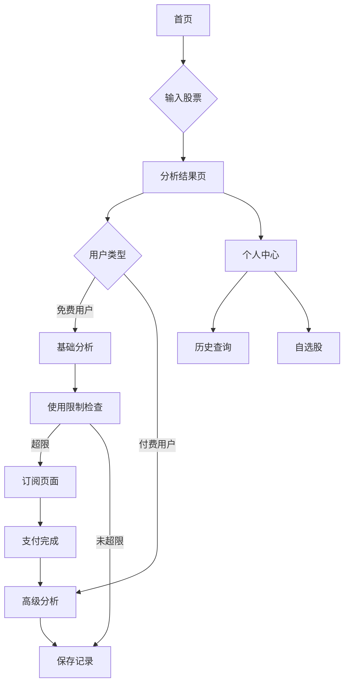

## 1. 产品概述
AI股票分析网站，通过AI大模型为投资者提供多维度股票分析和投资决策支持。用户输入股票代码即可获得专业的分析报告和投资建议。
- 解决投资者信息获取不全面、分析不专业的问题
- 目标用户：个人投资者、投资顾问、金融机构
- 市场价值：成为最智能、最专业的股票分析平台

## 2. 核心功能

### 2.1 用户角色
| 角色 | 注册方式 | 核心权限 |
|------|----------|----------|
| 免费用户 | 邮箱注册 | 基础股票查询、每日3次AI分析 |
| 付费用户 | 邮箱注册+订阅付费 | 无限次AI分析、高级分析维度、历史报告保存 |
| 专业用户 | 邮箱注册+专业认证 | 批量分析、API接口、定制化报告 |

### 2.2 功能模块
核心页面包括：
1. **首页**：搜索输入、热门股票、市场概览
2. **分析结果页**：多维度AI分析、图表展示、投资建议
3. **个人中心**：历史查询、收藏股票、订阅管理
4. **登录注册页**：用户认证、订阅升级

### 2.3 页面详情
| 页面名称 | 模块名称 | 功能描述 |
|----------|----------|----------|
| 首页 | 搜索模块 | 输入股票代码/名称，支持模糊搜索和自动补全 |
| 首页 | 热门股票 | 展示市场热门股票和涨跌幅排行 |
| 首页 | 市场概览 | 显示大盘指数、行业板块表现 |
| 分析结果页 | 基础信息 | 显示股票基本信息、实时价格、成交量 |
| 分析结果页 | AI分析报告 | 生成技术分析、基本面分析、市场情绪分析 |
| 分析结果页 | 多维度图表 | K线图、技术指标图、资金流向图 |
| 分析结果页 | 投资建议 | 基于AI分析的买卖建议、风险提示 |
| 个人中心 | 历史记录 | 查看历史查询记录和分析报告 |
| 个人中心 | 自选股 | 管理关注的股票，设置价格提醒 |
| 个人中心 | 订阅管理 | 查看会员状态、升级订阅、支付管理 |
| 登录注册页 | 用户认证 | 邮箱注册、登录、密码重置 |
| 登录注册页 | 订阅选择 | 展示不同会员等级的功能和价格 |

## 3. 核心流程
用户操作流程：
1. 用户访问首页，输入股票代码或选择热门股票
2. 系统展示股票基础信息和实时数据
3. 用户点击"AI分析"按钮，系统调用AI大模型进行分析
4. 展示多维度分析报告，包括技术面、基本面、市场情绪等
5. 用户可保存报告、分享或设置提醒

付费用户流程：
1. 免费用户达到使用限制时提示升级
2. 用户选择订阅套餐并完成支付
3. 解锁高级功能：无限分析、深度报告、批量查询等

## 4. 用户界面设计

### 4.1 设计风格
- **主色调**：深蓝色(#1E3A8A)体现专业金融感，辅以绿色(#10B981)表示上涨，红色(#EF4444)表示下跌
- **按钮样式**：圆角矩形，主要操作用实心按钮，次要操作用边框按钮
- **字体**：中文使用思源黑体，数字使用Roboto Mono，确保数据清晰可读
- **布局风格**：卡片式布局，顶部导航栏，侧边栏用于筛选和工具
- **图标风格**：使用简洁的线性图标，符合金融应用的专业感

### 4.2 页面设计概述
| 页面名称 | 模块名称 | UI元素 |
|----------|----------|--------|
| 首页 | 搜索模块 | 居中搜索框，自动补全下拉列表，搜索按钮使用主色调 |
| 首页 | 热门股票 | 卡片式列表，显示股票名称、价格、涨跌幅，用红绿色区分 |
| 分析结果页 | 基础信息 | 顶部横幅显示股票名称、当前价格、涨跌幅，大号字体 |
| 分析结果页 | AI分析报告 | 分段式卡片，包含图表、文字分析、评分星级 |
| 分析结果页 | 多维度图表 | 专业的K线图和指标图，支持缩放和时间段选择 |
| 个人中心 | 历史记录 | 时间轴式列表，显示查询时间和股票名称 |
| 个人中心 | 自选股 | 网格布局，显示股票卡片，支持拖拽排序 |

### 4.3 响应式设计
- 桌面端优先设计，适配1920x1080主流分辨率
- 平板端自适应，保持核心功能完整
- 移动端采用底部导航栏，简化操作流程
- 图表使用响应式库，确保在小屏幕上可读

### 4.4 数据可视化指导
- K线图使用专业的金融图表库，支持技术指标叠加
- 使用渐变色表示价格趋势，增强视觉效果
- 关键数据点添加动画效果，提升用户体验
- 采用专业的金融数据格式，保留小数点后两位